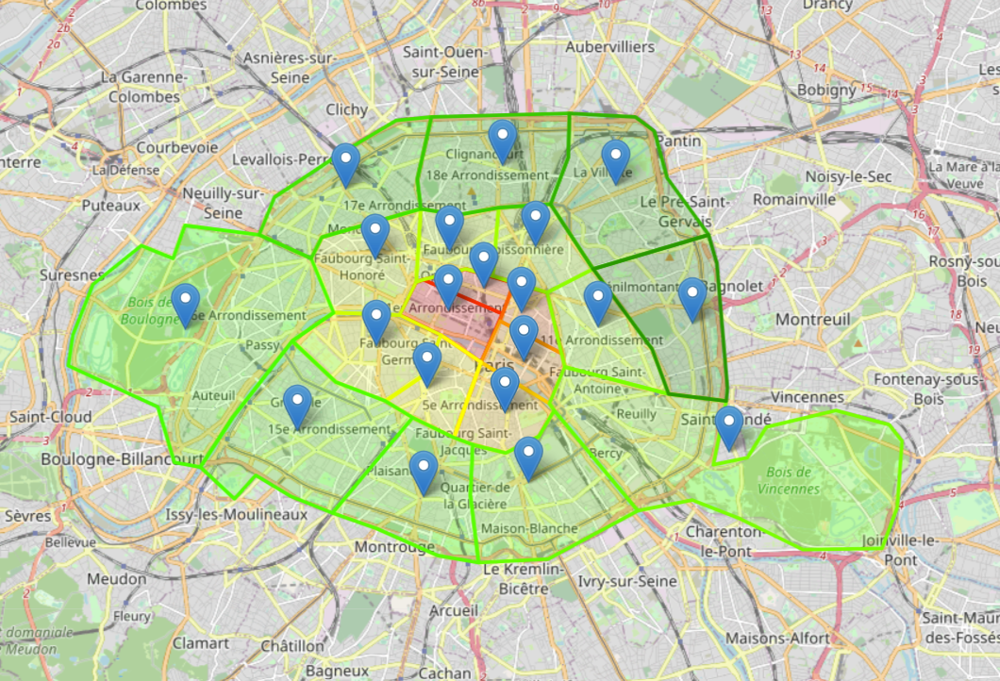

# Analyse des données DVF
## Projet de fin de semestre en Python

**Elias TOURNEUX** et **Yann VILLELLAS**
TD I, étudiant à l'ESILV en A3, promo 2025
### Installation
Vous devez mettre à la racine de votre projet les valeurs foncières de 2019 et 2022, disponibles sur l'[open data du gouvernement](https://www.data.gouv.fr/fr/datasets/demandes-de-valeurs-foncieres/).

#### Django
Pour lancer notre site fait sur Django, vous devez [installer django](https://docs.djangoproject.com/fr/4.2/intro/install/). Après avoir suivi le tutoriel d'installation, rendez-vous à la racine du projet et exécutez la commande suivante :
- `python mysite/manage.py runserver`
- Et voilà, votre site est disponible à l'adresse [127.0.0.1:8000](127.0.0.1:8000).

### Mini-rapport :
#### Avancement et difficultés :
Nous avons eu beaucoup de problèmes lors du tri des données. Certaines valeurs étaient faussés, comme par exemple la surface inférieur à 1 m² par exemple, ou encore des noms de ville avec un tiret parfois sans espace, parfois avec un espace. Nous avons donc du faire beaucoup de tests pour pouvoir trier les données correctement. Nous avons aussi eu des problèmes avec les graphiques, car nous n'avions pas compris comment les utiliser. Nous avons donc du faire des recherches pour pouvoir les utiliser correctement.
Nous avons souhaités faire des cartes dynamiques à l'aide de Folium, et cela nous a aussi pris beaucoup de temps pour comprendre le concept de geojson.
#### Ratio de contribution:
 - Elias TOURNEUX : 50 %
 - Yann VILLELLAS : 50 %
